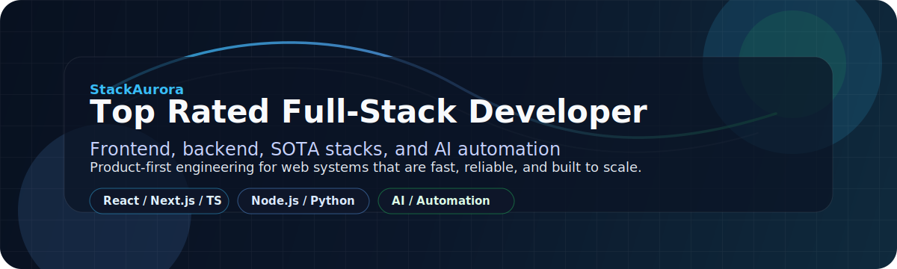

  

---

<table width="100%">
  <tr>
    <td width="68%" valign="top">
      <h2>Hello everyone</h2>
      <h4>Welcome to my profile</h4>
      

        Full-stack developer focused on frontend, backend, SOTA stacks, and AI automation.
        I build products that ship fast, scale cleanly, and remove repetitive work.
      

      

        React / Next.js / TypeScript / Node.js / Python / PostgreSQL / MySQL / Redis / Docker.
        Product-minded engineer with a bias for practical architecture, performance, and measurable outcomes.
      

    </td>
    <td width="32%" valign="top">
      <h3>Profile Snapshot</h3>
      
<strong>6</strong> selected repositories

      
<strong>4</strong> product areas: SaaS, AI, analytics, healthcare

      
<strong>Full-stack</strong> delivery from UI to API to data layer

    </td>
  </tr>
</table>

<table width="100%">
  <tr>
    <td>
      <strong>Focus</strong> 
      Frontend, full-stack, backend systems, AI automation
    </td>
    <td>
      <strong>Working style</strong> 
      Product-minded, iterative, maintainability-first
    </td>
    <td>
      <strong>Priority</strong> 
      Outcomes, reliability, performance, clarity
    </td>
  </tr>
</table>

  <h3>Core Languages & Platforms</h3>
  

    
    
    
    
    
    
    
    
  

<table>
  <tr>
    <td><strong>Role focus</strong></td>
    <td>Frontend, full-stack, backend systems, AI automation</td>
  </tr>
  <tr>
    <td><strong>Experience</strong></td>
    <td>Full-stack portfolio across SaaS, analytics, healthcare, and AI chatbot systems</td>
  </tr>
  <tr>
    <td><strong>Current stack</strong></td>
    <td>React, Next.js, TypeScript, Node.js, Python, FastAPI, PostgreSQL, MySQL, Redis, Docker</td>
  </tr>
  <tr>
    <td><strong>Working style</strong></td>
    <td>Product-minded, iterative, maintainability-first, outcome-driven</td>
  </tr>
  <tr>
    <td><strong>Open source</strong></td>
    <td>AI applications, SaaS platforms, analytics tools, and reusable full-stack patterns</td>
  </tr>
</table>

  
<strong>Building software that is useful in production, not just impressive in a demo.</strong>

## What I do / How I work

I turn product ideas into reliable web systems.

I usually work from the interface down to the infrastructure: define the user flow, map the API contract, shape the data model, then automate the repetitive parts so the team can move faster with less friction.

For AI features, I prefer grounded implementations over demos. That means workflows with guardrails, retrieval when needed, structured outputs, retries, evals, and a clear human-in-the-loop path when the task matters.

## Areas of Expertise

<table>
  <tr>
    <td>
      <strong>Frontend Engineering</strong>
      <ul>
        <li>React, Next.js, TypeScript</li>
        <li>Design systems, component architecture, accessibility</li>
        <li>Performance optimization and responsive UI</li>
      </ul>
    </td>
    <td>
      <strong>Backend Systems</strong>
      <ul>
        <li>Node.js, Express, NestJS</li>
        <li>Python, FastAPI, background jobs</li>
        <li>REST APIs, auth, integrations, service design</li>
      </ul>
    </td>
  </tr>
  <tr>
    <td>
      <strong>AI / Automation</strong>
      <ul>
        <li>LLM integrations, prompt systems, structured outputs</li>
        <li>Agents, tool use, workflow orchestration</li>
        <li>RAG, embeddings, semantic search</li>
      </ul>
    </td>
    <td>
      <strong>DevOps / Quality</strong>
      <ul>
        <li>Docker, CI/CD, environment management</li>
        <li>Testing with Jest, Vitest, Playwright, Cypress</li>
        <li>Monitoring, logging, release discipline</li>
      </ul>
    </td>
  </tr>
</table>

## Tech Stack

### Frontend

- React, Next.js, TypeScript
- Tailwind CSS, modern component systems, design systems
- State management, data fetching, accessibility
- Motion, responsiveness, and performance tuning

### Backend

- Node.js, Express, NestJS
- Python, FastAPI, background jobs
- PostgreSQL, Redis, MongoDB
- REST APIs, auth, integrations, and service design

### AI / Automation

- LLM integrations, prompt systems, structured outputs
- Agents, tool use, workflow orchestration
- RAG, embeddings, semantic search
- Internal copilots, task automation, and pipeline design

### DevOps / Quality

- Docker, CI/CD, environment management
- Jest, Vitest, Playwright, Cypress
- Logging, monitoring, release discipline
- Code review, docs, and maintainability-first delivery

## Skills I have

  
  
  
  

## Selected Work

<table>
  <tr>
    <td width="50%" valign="top">
      <h3><a href="https://github.com/StackAurora/Air-Quality-Trend-Analysis">Air Quality Trend Analysis</a></h3>
      

        Full-stack air quality analytics platform for PM2.5 and PM10 monitoring, multi-source aggregation,
        forecasting, natural-language analytics, and professional reporting.
      

      
<strong>Outcome:</strong> Demonstrates end-to-end data ingestion, FastAPI services, React analytics UI, AI forecasting, and LLM planning workflows.

    </td>
    <td width="50%" valign="top">
      <h3><a href="https://github.com/StackAurora/Resume-Wizard-SaaS">Resume Wizard SaaS</a></h3>
      

        AI-powered resume builder with authenticated user flows, resume creation, editing, previewing,
        download support, and AI-assisted content generation.
      

      
<strong>Outcome:</strong> Shows SaaS product thinking across frontend UX, authentication, CMS-backed data, and generative AI assistance.

    </td>
  </tr>
  <tr>
    <td width="50%" valign="top">
      <h3><a href="https://github.com/StackAurora/AI-Chatbot-Fullstack">AI Chatbot Fullstack</a></h3>
      

        Full-stack chatbot architecture with React, FastAPI, WebSockets, Redis, worker services,
        and AI model integration for real-time conversational experiences.
      

      
<strong>Outcome:</strong> Highlights real-time backend design, async workflows, API services, and production-style app architecture.

    </td>
    <td width="50%" valign="top">
      <h3><a href="https://github.com/StackAurora/AI-SaaS-Fullstack-Platform">AI SaaS Fullstack Platform</a></h3>
      

        AI SaaS platform built around conversation, code, image, music, and video generation with
        billing, database modeling, and a polished app interface.
      

      
<strong>Outcome:</strong> Brings together Next.js, AI APIs, Prisma, Stripe, and modern SaaS delivery patterns.

    </td>
  </tr>
  <tr>
    <td width="50%" valign="top">
      <h3><a href="https://github.com/StackAurora/Multi-Model-AI-Chatbot">Multi-Model AI Chatbot</a></h3>
      

        Universal AI chat hub supporting multiple providers such as Gemini, Groq, OpenRouter,
        Hugging Face, and OpenAI, with chat history and analytics-oriented UI patterns.
      

      
<strong>Outcome:</strong> Shows provider abstraction, fallback-ready AI UX, TypeScript frontend work, and full-stack AI product composition.

    </td>
    <td width="50%" valign="top">
      <h3><a href="https://github.com/StackAurora/Healthcare-SaaS-Platform">Healthcare SaaS Platform</a></h3>
      

        Clinical management SaaS platform covering patient records, doctors, appointments,
        prescriptions, advanced search, authentication, responsive UI, and multilingual support.
      

      
<strong>Outcome:</strong> Demonstrates domain-heavy product engineering with secure workflows, CRUD systems, and healthcare-grade information design.

    </td>
  </tr>
</table>

## AI Automation Capabilities

- Build workflows that combine LLMs with business logic, APIs, and human review
- Design RAG systems for docs, support content, and internal knowledge
- Create agentic flows for research, summarization, classification, and task execution
- Add structured output schemas, retries, fallbacks, and guardrails
- Integrate automation with email, CRM, ticketing, docs, and internal tools
- Measure quality with evals, telemetry, and feedback loops

## Currently Learning / Roadmap

- Better LLM evals and reliability patterns
- Multi-step orchestration for AI systems
- Frontend performance at scale
- Product analytics and experimentation

## Open To

- Full-time or contract roles in frontend, full-stack, or AI automation
- Collaboration on SaaS products, internal tools, and developer tooling
- Consulting on system design, automation strategy, and AI feature delivery
- Open-source work with clear technical direction

---

*Last updated: 2026-07-14*
